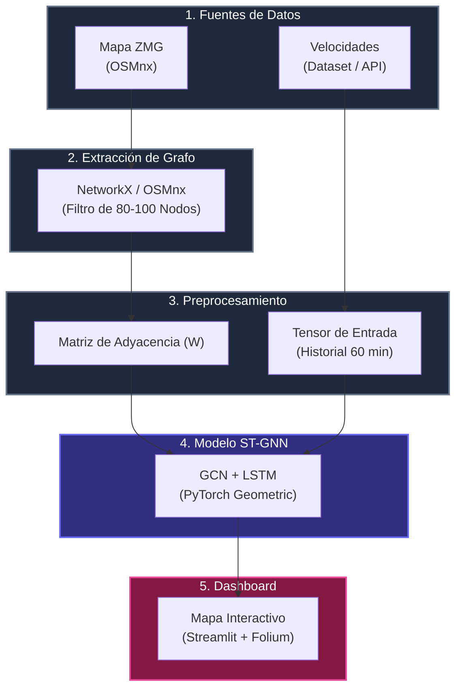

# Sistema de Predicción Espacio-Temporal de Tráfico Urbano
--------------------------
### 1- Visión general y problemática:
#### 1.1 Contexto:
En el área metropolitana de Guadalajara habitan *1.323.777* de personas de las cuales 82.3 de cada 100  tienen autos, esto a desembocado en una crisis de trafico y  movilidad,  debido a la falta de planeación y desarrollo. Donde el trafico de las arterias principales de la ciudad (Lopez mateos, Vallarta, Carretera Chapala, etc.) se ven colapsadas, ante esto podemos ver como el trafico se esparce a arterias secundarias y terciarais, demostrando que la dinámica del flujo vehicular no es un proceso aislado por calle, sino un sistema en red altamente acoplado, donde un accidente o una inundación en una calle o avenida tiene repercusión que se propaga en las calles o avenidas aledañas.
// VERIFICAR FUENTES
#### 1.2 Oportunidad y Enfoque:
Este proyecto propone un enfoque espacio-temporal sobre grafos (ST-GNN) que modela simultáneamente:

- **El espacio:** La estructura física de las avenidas y sus interconexiones (Grafo).
    
- **El tiempo:** La velocidad del tráfico y la tendencia de las últimas horas (Serie Temporal).

Utilizaremos este enfoque ya que nos permite resolver los dos componentes principales del problema (espacio y tiempo), dado que con enfoques tradicionales nos quedamos cortos al no poder comprender y analizar la totalidad del problema, ya sea porque trabajan de manera aislada sin tomar en cuenta que el trafico se propaga al tener embotellamientos y que existe una arquitectura de caminos, o no toman en cuanta el factor del tiempo (horas pico, variabilidad de la semana y días festivos).
### 2. Objetivos del Sistema:
#### 2.1
1. **Predicción Directa Multi-Horizonte:** Estimar las velocidades y niveles de congestión a **30 y 60 minutos** en el futuro de forma simultánea.
    
2. **Plataforma Visual Interactiva:** Proveer un dashboard en tiempo real con codificación visual del nivel de servicio vial.
    
3. **Validación Metodológica:** Comparar el rendimiento del modelo frente a métodos tradicionales (Promedio Histórico, Modelos Persistentes, LSTM aislada).

Se opta por un enfoque multi-horizonte para evitar la acumulación iterativa de errores propia de los modelos autorregresivos, manteniendo un único modelo eficiente en memoria que captura la dinámica de propagación de tráfico a 30 y 60 minutos de forma consistente

#### 2.2 Alcance y Cobertura
Se trabajara sobre el mapa de la Zona Metropolitana de Guadalajara, tomando solamente las principales vías y corredores.
Se busca obtener alrededor de 80-100 nodos para la red de grafos con granularidad temporal de muestreo cada 5min en horarios predefinidos(dependiendo las consultas de la API).

### 3. Arquitectura del Sistema:

### 4. Fundamentos Teóricos y Modelado Matemático:
Para este modelo espacio-temporal, no se utiliza una matriz de adyacencia binaria común (de puros $0$ y $1$), sino una [[Matriz de Adyacencia Gaussiana Ponderada]] ($W \in \mathbb{R}^{N \times N}$).  Esta al forzar a `0` todas las conexiones lejanas, hace que la matriz queda llena de ceros lo cual ahorra memoria y acelera los cálculos.

Nuestra matriz W guía a la red para comprender cuanto importancia darle al trafico de las avenidas vecinas al momento de predecir el trafico futur